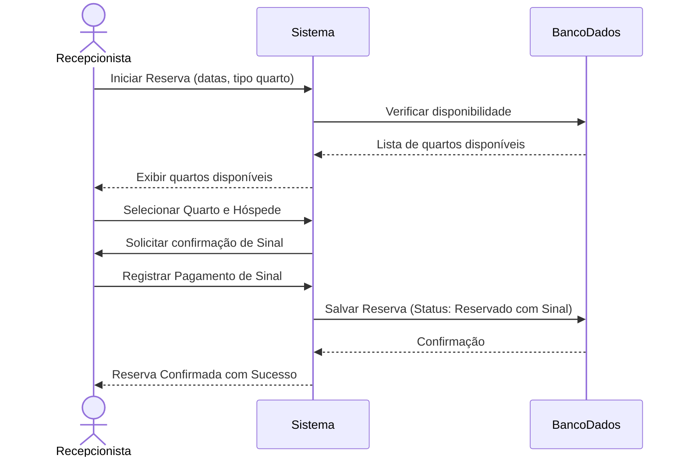
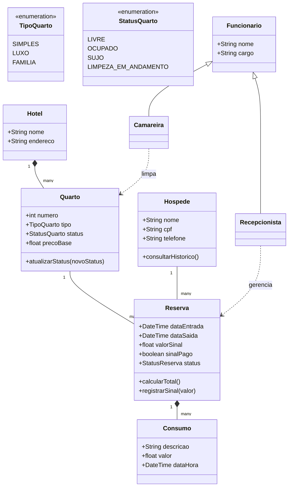
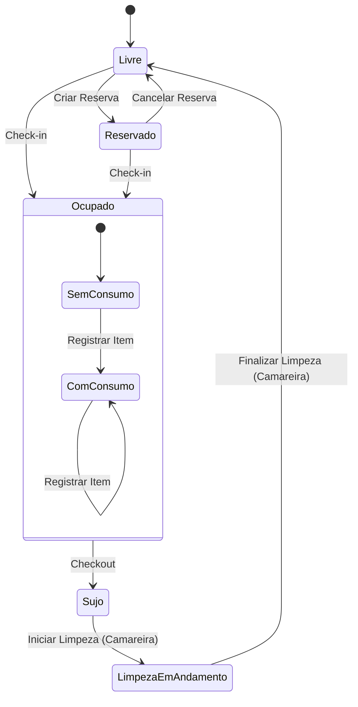

# PIM (Platform Independent Module) - Sistema de Gestão Hotel Bela Vista

Este documento apresenta o Platform Independent Module (PIM) para o Sistema de Gestão do Hotel Bela Vista, conforme os requisitos levantados e validados. O PIM é dividido em três partes principais, utilizando diagramas UML para representar a interação, a estrutura e o comportamento do sistema.

## Parte 1: Interação - Diagrama de Sequência

O Diagrama de Sequência ilustra a ordem das interações entre os atores e os objetos do sistema para um cenário específico. Abaixo, é apresentado o fluxo de registro de uma reserva com pagamento de sinal.

### Cenário: Registro de Reserva com Sinal

## Parte 2: Estrutural - Diagrama de Classes

O Diagrama de Classes representa a estrutura estática do sistema, mostrando as classes, seus atributos, métodos e os relacionamentos entre elas. Este diagrama reflete as entidades principais do domínio do Hotel Bela Vista.

## Parte 3: Comportamental - Diagrama de Estados

O Diagrama de Estados descreve os possíveis estados de um objeto (neste caso, um Quarto) e as transições entre esses estados em resposta a eventos. Ele modela o ciclo de vida de um quarto dentro do sistema.

