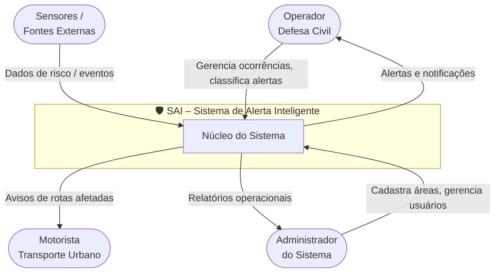
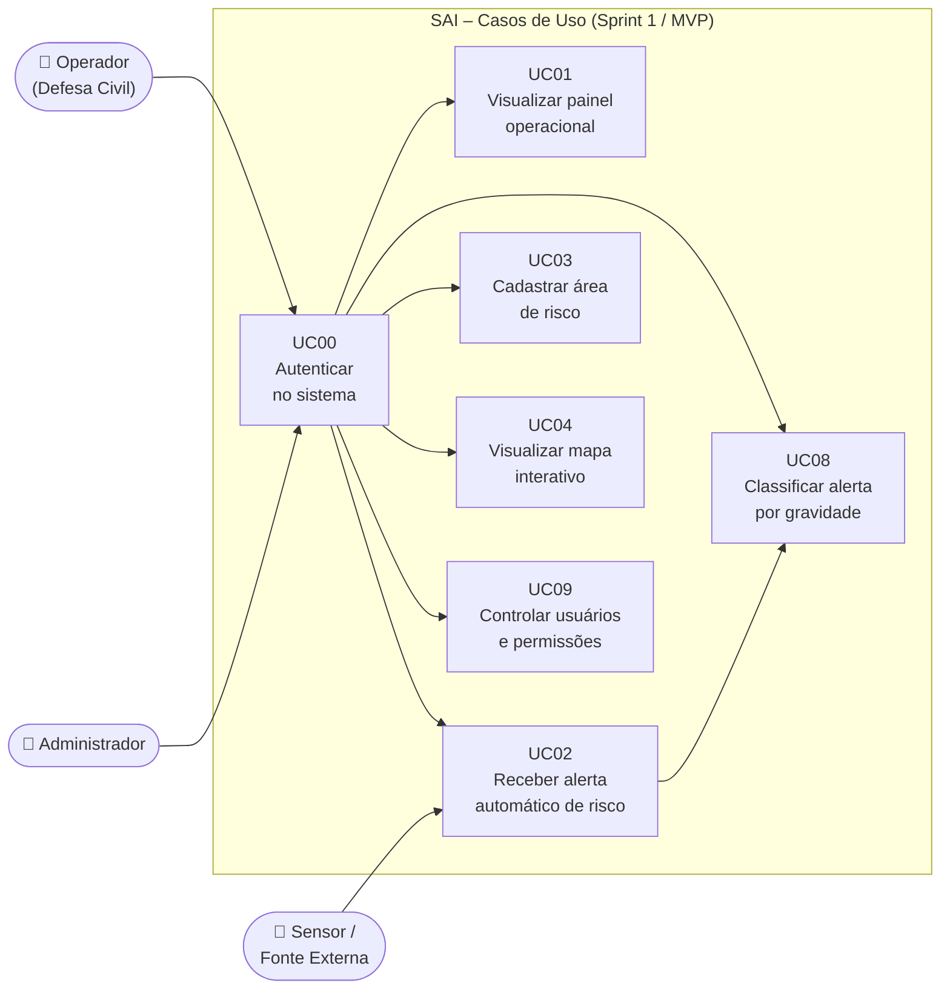
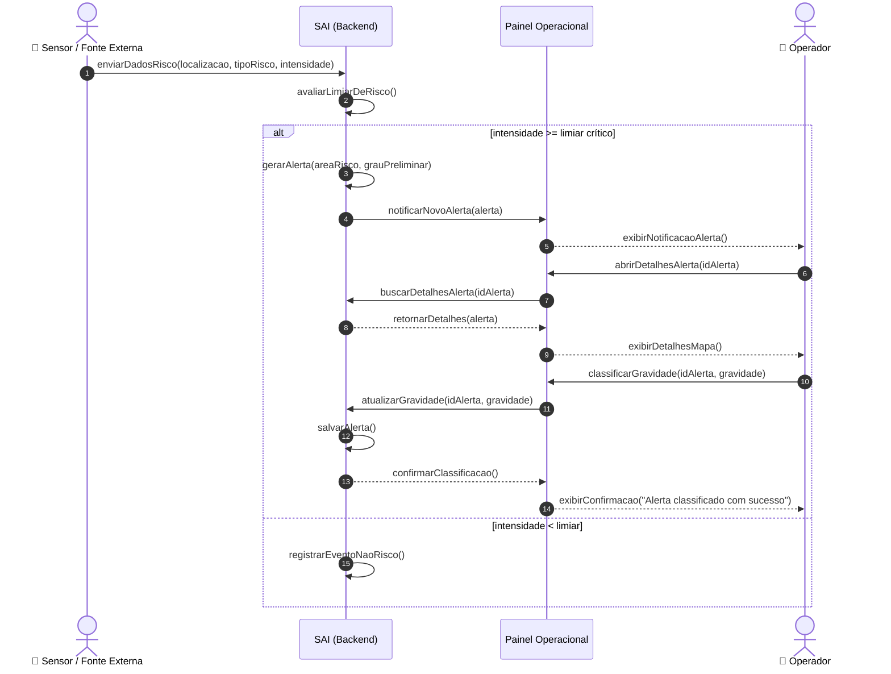
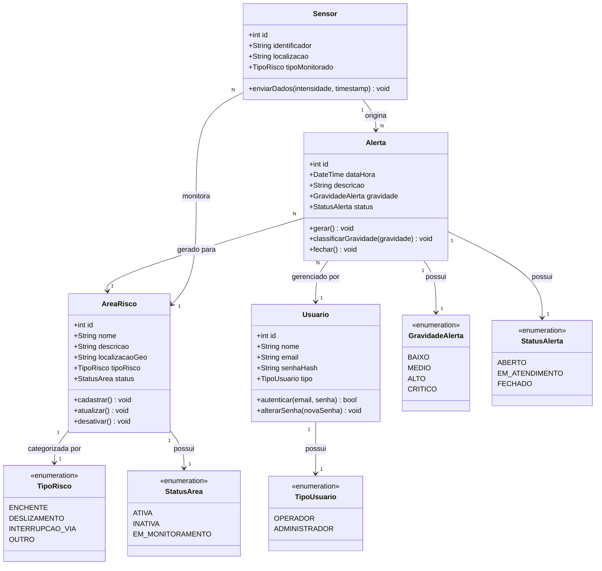

# SAI – Sistema de Alerta Inteligente

**Projeto Final – Etapa 2 | Sprint 1**
**Desenvolvimento Ágil com Scrum**

**Instituto Federal de São Paulo – Campus São João da Boa Vista**
Curso: Tecnologia em Sistemas para Internet
Professor: Gaio Belitardo de Oliveira

**Integrantes:**
- Alexandro de Oliveira dos Santos
- André Frigo Lima
- Danilo Rodrigues Alves de Sousa
- Rafael Torres de Araujo
- Victor Emanuel de Souza

São João da Boa Vista – SP, 2026

---

## 1. Cronograma de Sprints (Release Plan)

O projeto está organizado em **3 Sprints** de 7 dias cada, com foco exclusivo em modelagem UML como Definição de Pronto (DoD).

| Sprint | Foco | User Stories | Duração |
|--------|------|-------------|---------|
| Sprint 1 | MVP – Must Have (modelagem do núcleo do sistema) | US01, US02, US03, US04, US08, US09 | 7 dias |
| Sprint 2 | Should Have – Extensões de valor | US05, US06, US07, US10 | 7 dias |
| Sprint 3 | Refinamento, integração dos modelos e revisão geral | Todas | 7 dias |

> **Definição de Pronto (DoD):** Diagrama UML revisado, validado pela equipe e publicado no repositório GitHub do projeto.

---

## 2. Sprint 1 — MVP: O Coração do Sistema

### 2.1 Escopo da Sprint

User Stories contempladas (todas classificadas como **Must Have** na Etapa 1):

| ID | Funcionalidade | Prioridade |
|----|----------------|------------|
| US02 | Alertas automáticos de risco | Must Have |
| US03 | Cadastro de áreas de risco | Must Have |
| US08 | Classificação de alertas por gravidade | Must Have |
| US01 | Painel operacional de riscos | Must Have |
| US04 | Mapa interativo de áreas de risco | Must Have |
| US09 | Controle de usuários e permissões | Must Have |

### 2.2 Meta da Sprint

> Arquitetar logicamente o fluxo principal do SAI — desde o cadastro de uma área de risco até a emissão e classificação de um alerta — de forma que a base do sistema esteja modelada sem falhas estruturais.

---

## 3. Entregáveis Técnicos da Sprint 1

---

### 3.1 Diagrama de Contexto

O Diagrama de Contexto (equivalente ao DFD Nível 0) define os limites do sistema SAI e os agentes externos que interagem com ele.

**Descrição:**
- **Operador da Defesa Civil:** interage com o painel operacional, recebe alertas e classifica ocorrências por gravidade.
- **Administrador:** cadastra áreas de risco, gerencia usuários e permissões.
- **Motorista:** recebe avisos sobre rotas afetadas (escopo futuro — Sprint 2).
- **Sensores / Fontes Externas:** alimentam o sistema com dados ambientais que disparam alertas automáticos.

---

### 3.2 Diagrama de Casos de Uso

Visão geral das funcionalidades do MVP e seus atores.

**Relacionamentos principais:**
- `UC_LOGIN` é pré-condição para todos os casos de uso autenticados (`<<include>>` implícito).
- `UC02 → UC08`: ao receber um alerta, o operador imediatamente pode classificar sua gravidade.
- O sensor/fonte externa é o ator que dispara `UC02` de forma automática.

---

### 3.3 Diagrama de Sequência — Fluxo Principal

Fluxo: **Recebimento automático de alerta e classificação por gravidade** (US02 + US08).

---

### 3.4 Diagrama de Classes — Domínio Básico

Modelo das entidades centrais do SAI para o MVP.

---

## 4. Considerações da Sprint 1

- Todos os diagramas cobrem exclusivamente as **6 User Stories Must Have** definidas na Etapa 1.
- O Diagrama de Contexto delimita claramente o escopo do SAI frente aos atores externos.
- O Diagrama de Sequência detalha o **fluxo crítico** do sistema: recebimento de dados de risco → geração automática de alerta → classificação pelo operador.
- O Diagrama de Classes estabelece o **domínio base** do sistema, incluindo entidades, atributos, relacionamentos e enumerações necessárias para o MVP.
- Funcionalidades `Should Have` (US05 – rotas, US06 – relatórios, US07 – WhatsApp/SMS, US10 – histórico) estão fora do escopo desta Sprint e serão modeladas na Sprint 2.

---

## 5. Próximos Passos (Sprint 2)

| US | Funcionalidade |
|----|----------------|
| US05 | Avisos de rotas afetadas |
| US06 | Relatórios operacionais |
| US07 | Alertas via WhatsApp/SMS |
| US10 | Histórico de alertas |
